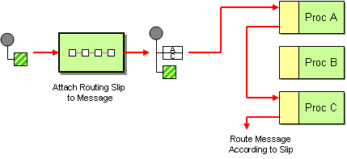

== Data Streaming Infrastructure

Data Streaming Infrastructure is responsible for reliable streaming of messages between services.
Herein Apache Kafka was chosen as the de facto standard for such kind of systems.
But similar approaches can be applied to any message streaming platforms.

=== Orchestration

The simplest approach is to put the identifiers of input / output queues (topics for kafka) for each service into their configuration.
But this is not flexible enough and can be applied to very simple application with wholly mature functionality.

In our case it is better to approach enterprise integration pattern "Routing Slip or Routing Table":

* attach a "Routing Slip" to each message, specifying the sequence of processing steps.
* Wrap each component with a special message router that reads the Routing Slip and routes the message to the next component in the list.

By introduction this pattern we can achieve next benefits:

* low cohesion between services
* deployment of new functionality will not require redeployment already existing related services. For example:
** if in case of sharding we want to send baskets with data to the servers, dedicated to the specific cities,
we have to enrich the messages with measurements before operation the distribution data among servers.
In the our simplest case there is no need to do it.
** in case of law related requirements from the market regulator, we will always be able to easily connect
the functionality of backup of all incoming message traffic.
* we can test new functionality or new versions of existing services with limited stream of data

So, we introduce the special service *EMCA stream manager* which has to perform the next operations:

* keep current schema of data processing
* enrich all incoming messages with
** copy of these schema
** container for logging data
* route them through corresponding topic  to the first service in the schema

Each next service performs the next operations:

* receive the message
* process data
* logging some data inside the message. For example, time of receiving and completion time
* read schema and determine the next service
* route this message (or derivative message with kept schema and log) through corresponding topic to the next service in the schema

The last service in the schema is technical monitoring service (out of the scope of this document), which collect logged data for further analysis.

This consequence of operation can be illustrated by the next diagram:

* we have only two services in the consequence: some service and technical monitoring service
* the source of data is Input queue" which is filled by *EMCA Collector* service

[plantuml, emca-streaming-orchestration, png]
....
boundary "EMCA Collector"
database "Input queue"
control "Stream Manager"
database "Configuration Store"
entity "Message"
control "EMCA Service"
control "EMCA monitoring"
database "Monitoring Store"

"EMCA Collector" -> "Input queue": store data for processing
"Stream Manager" -> "Input queue": read message
"Stream Manager" -> "Configuration Store": read schema for message
"Stream Manager" -> "Message": enrich content with schema and log sections
"Stream Manager" -> "Message": determine first service
"Stream Manager" -> "EMCA Service": pass message

"EMCA Service" -> "Message": process data
"EMCA Service" -> "Message": read schema and determine next service
"EMCA Service" -> "Message": enrich log section with technical statistic
"EMCA Service" -> "EMCA monitoring": send for completion

"EMCA monitoring" -> "Message": read log section
"EMCA monitoring" -> "Monitoring Store": save data for analysis
....

The incoming data processing scheme for this application will look approximately as follows structure:

* Deduplication Service - remove duplicates of data batches, unavoidably sent by *EMCA-GATEWAY-AE*
* Regrouping Service - regroup data from several *BatchRequest* messages in order to have the only one meter's data in the message
* parallel processing
** Enrichment Service - enrich messsage with additional data about the meter. For example, data, which will be used for
multi level aggregation: group, building, district, city
*** Runtime Analysis Service
** Storage Data Service
* Monitoring Service

This schema can be presented as a next data stream diagrams

[plantuml, emca-streaming-flow, png]
....
[EMCA-GATEWAY-AE] -right-> [EMCA Collector]
[EMCA Collector] -down-> [Stream Manager]
[Stream Manager] -left-> [Deduplication Service]
[Deduplication Service] -down-> [Regrouping Service]

[Regrouping Service] -down-> [Storage Data Service]

[Regrouping Service] -right-> [Enrichment Service]

[Enrichment Service] -down-> [Runtime Analysis Service]

[Storage Data Service] -down-> [EMCA monitoring]
[Runtime Analysis Service] -down-> [EMCA monitoring]
....

=== Reliability of data processing

The most important task of the data streaming infrastructure is to ensure the reliability of data processing in terms of loss elimination.

If some service only processing data of messages in stateless way and without side effects in other systems
we don't have any problem: kafka provides "read-process-write" atomic processing by transactional API and this is fast enough.

But we regularly deal with service's instance which:

* change data in some external storage
* not real "stateless", because it calculates something and caches internally before writing in the external permanent storage

In this case we're in big trouble, because after sudden shutdown of the service or storage  in the middle of an operation we
have Inconsistency between stream, state and storage. For example, some fragment of data was already processed
and saved in the storage but not sent in the output queue. In this case after restart it will be received and processed second time
and as a result the state of the storage will be changed twice.
Also, we of course have the similar troubles if the storage was suddenly shutdown and we deal with the outdated snapshot.

We can reach the reliability of the instance by the next approach:

* after receiving the message, we process them with updating internal state and send output message with commit
"read-process-write" operation. Only after that from time to time we can flush data in the permanent storage with mandatory
writing the current offset in the kafka's topic
* after crash of instance and restart we have empty internal state and outdated storage. So, from kafka's point of view some
messages were already process, but internal state and storage "forgot" about it
* but we can read from the storage the offset of last "remembered" message and perform the next operations:
** don't start to receive messages
** restore internal state from the storage.
** read from the incoming queue all messages which are younger then known saved offset
** process them again without (this is key moment) sending any output messages
** save snapshot of the internal state
** continue receive messages

This approach is simple, but maintenance pause is long.

Another approach is parallel processing of the same messages by two instances - master and slave. In this situation in
case of a crash we don't have spend time on the snapshot loading and continue to process immediately.
But there are several disadvantages:

* another component of the infrastructure - supervisor (Apache Zookeeper, for example), turning slave into master
* two running instances instead of one is more expensive
* we still have to do something with messages, were not sent during the detection of the crash and switching.
So, this approach is some kind of extension previous one.

We can reach the reliability of the permanent storage by the next common approaches:

* Best of all is simply deal with reliable cluster
* we can regularly takes a snapshot of the storage.
** In case of crash we again deal with the situation, when some messages
are already processed from kafka's point of view, but storage is now aware about it.
** We can apply the same procedure, as previously

This subject will no longer be discussed for most services connected to the infrastructure.

